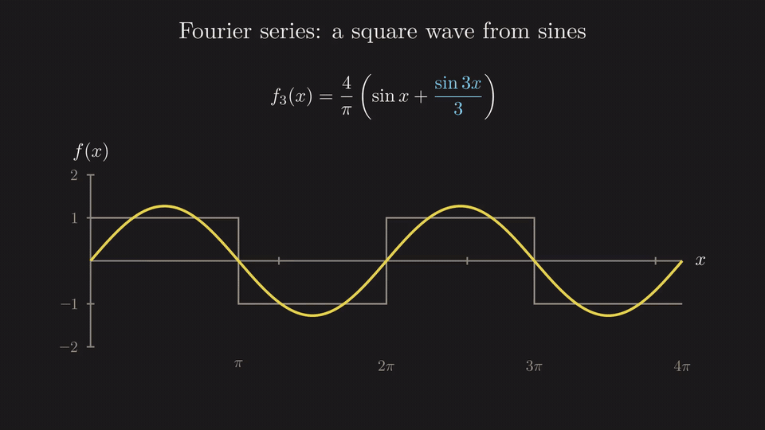
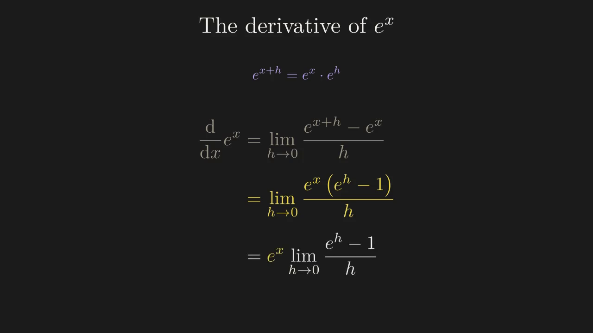
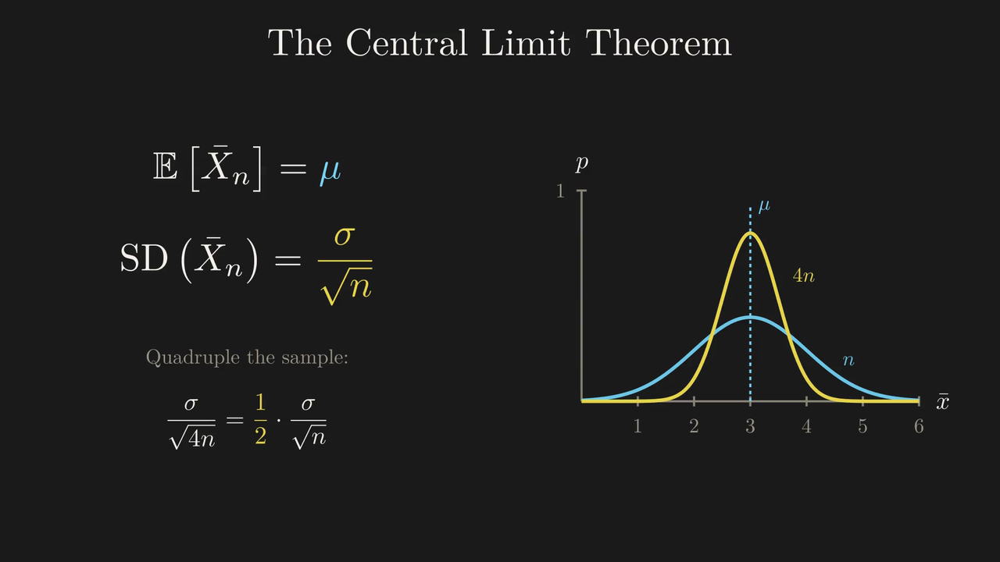
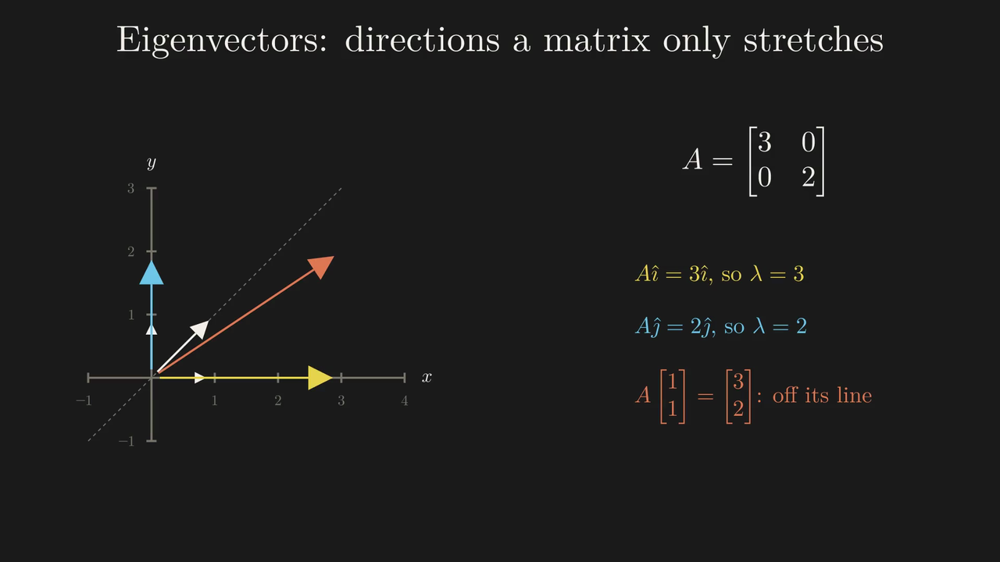
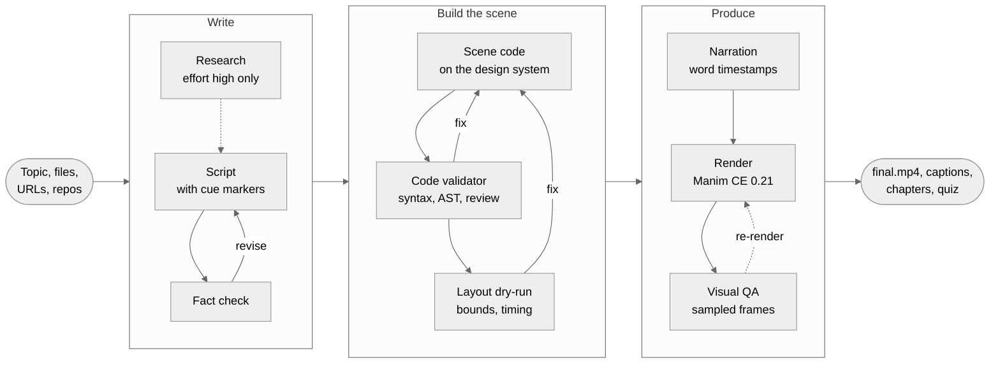
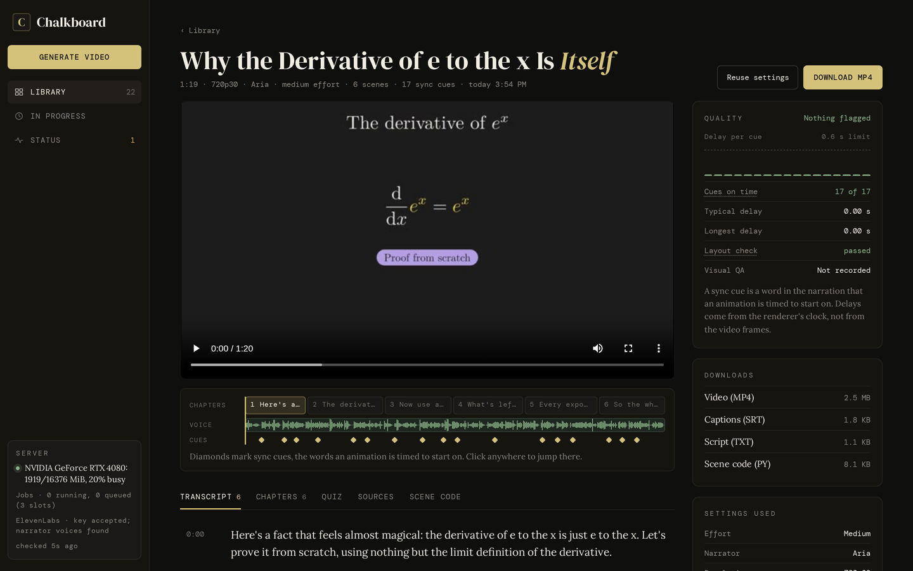
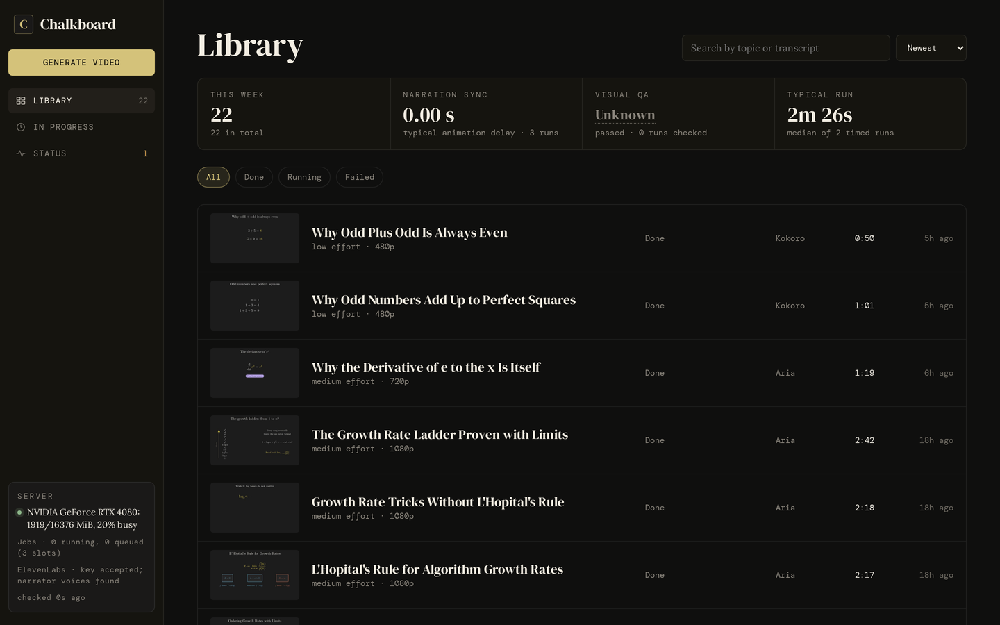
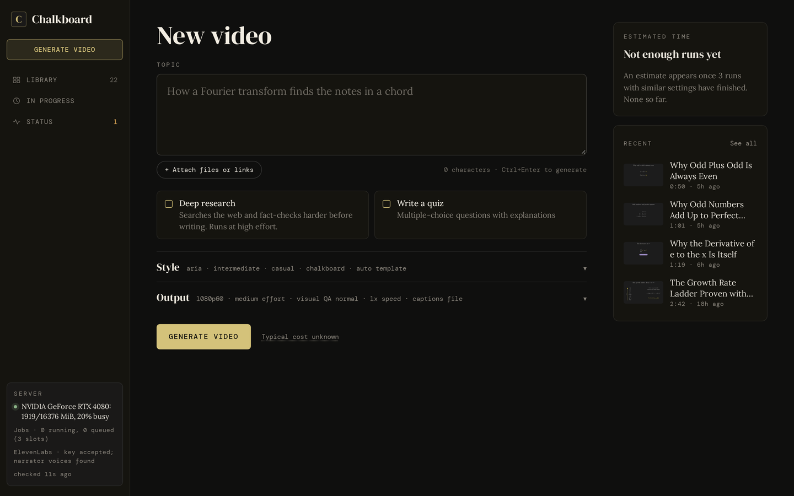

<p align="center">
  <picture>
    <source media="(prefers-color-scheme: dark)" srcset="docs/readme/logo-dark.svg">
    <source media="(prefers-color-scheme: light)" srcset="docs/readme/logo-light.svg">
    
  </picture>
</p>

<p align="center">
  <b>Turn a topic into a narrated, LaTeX-quality math and science explainer video.</b><br>
  Self-hosted. Claude writes and checks the script, Manim draws it, a narrator reads it in sync.
</p>

<p align="center">
  <a href="https://github.com/nicglazkov/Chalkboard/actions/workflows/tests.yml"></a>
  <a href="LICENSE"></a>
  
  
  
  
</p>

<p align="center">
  <a href="#quick-start">Quick start</a> ·
  <a href="#web-ui">Web UI</a> ·
  <a href="#cli">CLI</a> ·
  <a href="#how-it-works">How it works</a> ·
  <a href="#reference">Docs</a> ·
  <a href="https://chalkboard.studio">chalkboard.studio</a>
</p>

<p align="center">
  
  <br>
  <sub>An excerpt from a generated video, <i>Fourier series: a square wave from sines</i> (trimmed, shown without audio).</sub>
</p>

Chalkboard is a pipeline of Claude agents built on LangGraph. Give it a topic, and optionally files, URLs or a GitHub repo to work from. It writes a script, fact-checks it, writes a Manim scene on a built-in design system, checks that scene statically and with a headless layout dry-run, records narration, renders, and has Claude review frames from the finished video. Every stage is checkpointed and retried on failure. You drive it from a web UI, a CLI, a REST API or a small Python SDK, all running on your own machine.

<table>
  <tr>
    <td width="50%"></td>
    <td width="50%"></td>
  </tr>
  <tr>
    <td><sub><i>Why the Derivative of e to the x Is Itself</i>, 720p30, narrator Aria</sub></td>
    <td><sub><i>Pascal's Triangle and the Binomial Theorem</i>, 720p30, narrator Milo</sub></td>
  </tr>
  <tr>
    <td width="50%"></td>
    <td width="50%"></td>
  </tr>
  <tr>
    <td><sub><i>Why Averages of Anything Look Normal</i>, 1080p60</sub></td>
    <td><sub><i>Eigenvectors: The Directions a Matrix Only Stretches</i>, 1080p60</sub></td>
  </tr>
</table>

<p align="center"><sub>Frames from four generated videos, resized but otherwise untouched. Every equation is real LaTeX (<code>MathTex</code>) set in Computer Modern.</sub></p>

## Why Chalkboard

<table>
  <tr>
    <td width="50%" valign="top"><b>Real math typesetting</b><br>Every equation goes through LaTeX with one shared preamble (amsmath, mathtools, siunitx, ...) and Computer Modern. Prose uses CMU Serif so text and math match.</td>
    <td width="50%" valign="top"><b>A design system, not raw Manim</b><br>Scenes are built from tokens, components, named animation moves and six scene templates, so videos look consistent from run to run.</td>
  </tr>
  <tr>
    <td valign="top"><b>Checked before it renders</b><br>The script is fact-checked. Scene code passes syntax and AST guards plus a headless dry-run that flags off-screen elements, overlaps and timing overruns. After the render, Claude reviews sampled frames.</td>
    <td valign="top"><b>Narration in sync, word by word</b><br>The script marks the words where visuals land. The TTS backend reports when each one is spoken, and the animation waits for its cue.</td>
  </tr>
  <tr>
    <td valign="top"><b>Narrators</b><br>ElevenLabs <code>eleven_v4</code> voices Aria and Milo with request stitching, free local Kokoro, or OpenAI.</td>
    <td valign="top"><b>A UI that does not guess</b><br>Live progress with Claude's output streaming in, a timeline and transcript per video, and a Status page built from real probes. If it cannot back a value, it says Unknown.</td>
  </tr>
  <tr>
    <td valign="top"><b>Bring your own material</b><br>Files, folders, PDFs, Word documents, images, URLs and GitHub READMEs as source context.</td>
    <td valign="top"><b>Yours to run</b><br>MIT licensed. Rendering, storage and the library stay on your machine; the network is used for Claude, cloud narrators and any URLs you hand it.</td>
  </tr>
</table>

## How it works



The steps from research through narration are a LangGraph state machine (`pipeline/graph.py`). Each validator either approves or sends feedback to the agent that produced the work. After three failed attempts the run stops and asks you what to do; unattended runs abort instead, except that a scene with only layout warnings is rendered anyway. Rendering, the voiceover merge, visual QA (up to two regenerate-and-re-render rounds), captions, chapters and the optional quiz run after the graph. Architecture, routing rules and known Manim pitfalls are documented in [CLAUDE.md](CLAUDE.md).

## Quick start

You need Python 3.10+, ffmpeg, an [Anthropic API key](https://console.anthropic.com/), and either a local TeX install (for local rendering) or Docker.

```bash
git clone https://github.com/nicglazkov/Chalkboard.git
cd Chalkboard
python -m venv .venv && source .venv/bin/activate
pip install -r requirements-render.txt    # pipeline, server, TTS, and manim 0.21.0
cp .env.example .env
```

Edit `.env`: set `ANTHROPIC_API_KEY` and pick a voice. `NARRATOR=kokoro` is free and runs locally (needs `espeak-ng`); `aria` and `milo` need `ELEVENLABS_API_KEY`; `alloy` needs `OPENAI_API_KEY`.

```bash
python run_server.py          # web UI at http://127.0.0.1:8000
```

or straight from the terminal:

```bash
python main.py --topic "why the derivative of e to the x is itself" --template derivation
```

The video lands in `output/<run_id>/final.mp4`, next to its captions, chapters, script and scene code. The default render is 720p30; add `--quality high` for 1080p60 or `--quality 4k` for 2160p60.

<details>
<summary><b>Rendering setup: local TeX or Docker</b></summary>

<br>

Scenes are rendered by Manim CE **0.21.0**. `RENDER_BACKEND` picks where:

| Value | What happens |
| --- | --- |
| `auto` (default) | `local` if `manim` is importable and `latex`, `dvisvgm` and `ffmpeg` are on `PATH`, else `docker` |
| `local` | Runs Manim natively. Faster: no container start, no image build |
| `docker` | Runs Manim in the `chalkboard-render` image (no local TeX needed) |

Both backends run the same layout dry-run and the same scene runtime (`docker/*.py`). The voiceover merge always runs with host ffmpeg.

**Local, Ubuntu / Debian:**

```bash
sudo apt install texlive texlive-latex-extra texlive-fonts-extra texlive-science lmodern cm-super \
  dvisvgm ffmpeg libcairo2-dev libpango1.0-dev pkg-config fonts-cmu espeak-ng
```

**Local, macOS** (untested): install [MacTeX](https://tug.org/mactex/), or BasicTeX plus the packages on the `tlmgr install` line in `docker/Dockerfile`. Then `brew install ffmpeg cairo pango pkg-config espeak-ng` and install the CMU Serif font.

Scene text uses CMU Serif when installed (falling back to Inter, then DejaVu Sans); code uses JetBrains Mono NL or DejaVu Sans Mono. Override with `CHALKBOARD_TEXT_FONT` / `CHALKBOARD_CODE_FONT`.

**Docker:** with `RENDER_BACKEND=docker` (or `auto` without TeX), the first render builds `chalkboard-render` from `docker/Dockerfile` (`manimcommunity/manim:v0.21.0` plus fonts and TeX packages). That takes a few minutes once; later runs reuse the image. The image was moved to Manim 0.21.0 along with the design system but has not been re-tested end to end since; local rendering is the tested path.

**Intel Macs:** PyTorch 2.4+ has no x86_64 macOS wheels, so Kokoro is unavailable there. Use an ElevenLabs or OpenAI narrator.

</details>

<details>
<summary><b>Running on a GPU box or another machine</b></summary>

<br>

Chalkboard can run on a different machine from the one you browse from, for example a GPU box that runs Kokoro on CUDA and renders faster. Install there and bind to all interfaces:

```bash
python run_server.py --host 0.0.0.0 --port 8000
```

Then open `http://<that-machine>:8000`. The server has **no authentication**, so only do this on a trusted network. Or keep the default `127.0.0.1` binding and tunnel:

```bash
ssh -L 8000:localhost:8000 user@that-machine     # then open http://localhost:8000
```

</details>

## Web UI

`python run_server.py` serves the UI and the API on one port (default `127.0.0.1:8000`). There is no build step.

<p align="center">
  
</p>

<table>
  <tr>
    <td width="50%"></td>
    <td width="50%"></td>
  </tr>
  <tr>
    <td><sub>Library: every rendered run, searchable by topic and transcript</sub></td>
    <td><sub>New video: topic, attachments, voice, style and output settings</sub></td>
  </tr>
</table>

- **New video.** Topic, attachments (files, folders, links), deep research, quiz, a narrator picker with playable samples, style (audience, tone, theme, template) and output (quality, effort, visual QA, speed, captions). The time estimate comes from your own finished runs and only appears once there are enough of them.
- **In progress.** Each pipeline stage as it happens, with Claude's script, fact check and scene code streaming in as they are written, token usage and cost per call, and render and TTS progress parsed from the real processes.
- **Video page.** Player, chapters, a timeline with the voice waveform and every sync cue, a transcript you can click to seek, quiz, sources, scene code, downloads, your own notes (saved inline, searchable from the library), and a quality panel with measured cue delays, the layout check and visual QA.
- **Status.** Real probes, cached for 60 seconds: Claude API, the Claude status page, ElevenLabs, Kokoro, OpenAI TTS, the renderer toolchain, GPU, disk and the job queue. Anything that cannot be checked without spending money shows as Unknown.

The rule behind all of it: the UI never shows a value it cannot back with a real source. Missing data reads "Unknown" or "Not recorded", never a placeholder. The full contract is in [docs/ui-data-contract.md](docs/ui-data-contract.md).

## CLI

```bash
python main.py --topic "how B-trees keep themselves balanced" --effort high --narrator aria
python main.py --topic "explain this codebase" --context ./src --context-ignore "*.lock"
python main.py --topic "summarize this paper" --context paper.pdf --quiz
python main.py --topic "how B-trees work" --preview     # quick 480p pass first
```

Common options: `--effort low|medium|high`, `--audience beginner|intermediate|expert`, `--tone casual|formal|socratic`, `--theme chalkboard|light|colorful`, `--template algorithm|code|compare|derivation|howto|timeline`, `--quality low|medium|high|4k`, `--narrator aria|milo|kokoro|alloy`, `--speed 1.15`, `--quiz`, `--burn-captions`, and `--yes` for unattended runs. The full list is in the [reference](#reference) below.

Each run writes to `output/<run_id>/`:

| File | What it is |
| --- | --- |
| `final.mp4` | The video, with chapter markers embedded (`preview.mp4` with `--preview`) |
| `captions.srt`, `chapters.txt` | Subtitles split per sentence on the narration timings, and chapter metadata |
| `script.txt`, `segments.json` | The narration and per-segment timing, including cue times |
| `scene.py` | The generated Manim scene |
| `layout_report.json`, `qa_frames/` | The last layout check (with the per-cue `cue_log`) and the frames visual QA reviewed |
| `quiz.json` | 4 to 6 multiple-choice questions with explanations (`--quiz`) |
| `manifest.json`, `run_stats.json`, `thumb.jpg` | Settings, timings, token usage and cost, thumbnail |

## Narrators

Pick one per run with `--narrator`, the `narrator` API field, or the voice picker in the UI. Set a default with `NARRATOR` in `.env`.

| Narrator | Backend | Cost | Notes |
| --- | --- | --- | --- |
| `aria` | ElevenLabs `eleven_v4` | Paid, per character | Young, bright female voice with a little nerdy charm (ElevenLabs voice Skye). Needs `ELEVENLABS_API_KEY` |
| `milo` | ElevenLabs `eleven_v4` | Paid, per character | Earnest male narrator (ElevenLabs voice Bradley). Needs `ELEVENLABS_API_KEY` |
| `kokoro` | Kokoro-82M, local | Free | Voice `af_heart`. Runs on the GPU when CUDA is available. Needs PyTorch 2.4+ and `espeak-ng` |
| `alloy` | OpenAI `gpt-4o-mini-tts` | Paid, per use | Segments synthesized in parallel. Needs `OPENAI_API_KEY` |

With no narrator set, `TTS_BACKEND` (`kokoro`, `openai` or `elevenlabs`) picks the backend with its default voice.

Aria and Milo came out of a blind listening test against OpenAI, Fish and Gemini voices, then an audition of `eleven_v4` against `eleven_v3`. On `eleven_v4`, segments are synthesized separately (their lengths drive the animation), but each request carries its neighbouring segments as context (**request stitching**), so intonation carries across the joins. A 1 to 3 minute video is roughly 1,000 to 3,000 characters of narration. Compare voices on your own machine with `python scripts/tts_bench.py --out bench/`.

**Word-level sync.** The script marks the words where visuals land (`[[1]]`, `[[2]]`, ...; never spoken or shown). The TTS backend reports when each marked word is spoken: ElevenLabs from its per-character timestamps, Kokoro from its token timings, OpenAI by estimate from character position. The scene calls `self.cue(k)` before each cued animation, so an equation appears as its word is said. Late cues are reported by the layout check, and every cue's spoken and shown time is logged in `layout_report.json`.

## Reference

The sections below are collapsed to keep this page short. For architecture and contribution notes see [CLAUDE.md](CLAUDE.md); for the web UI's data rules see [docs/ui-data-contract.md](docs/ui-data-contract.md).

<details>
<summary><b>CLI flags</b> &nbsp;<sub>All <code>main.py</code> flags</sub></summary>

<br>

| Flag | Default | Description |
| --- | --- | --- |
| `--topic` | required | Topic to explain, e.g. `"how B-trees work"` |
| `--effort` | `medium` | Fact-check depth and research (see Effort levels below) |
| `--audience` | `intermediate` | `beginner`, `intermediate`, `expert` |
| `--tone` | `casual` | `casual`, `formal`, `socratic` |
| `--theme` | `chalkboard` | `chalkboard`, `light`, `colorful` |
| `--template` | none | `algorithm`, `code`, `compare`, `derivation`, `howto`, `timeline` |
| `--quality` | `MANIM_QUALITY` | `low` (480p15), `medium` (720p30), `high` (1080p60), `4k` (2160p60) |
| `--narrator` | `NARRATOR` | `aria`, `milo`, `kokoro`, `alloy` |
| `--speed` | `1.0` | Narration speed. OpenAI: native (0.25 to 4.0). Kokoro and ElevenLabs: ffmpeg `atempo` |
| `--run-id` | auto | Resume a previous run from its checkpoint |
| `--preview` | off | Render a fast 480p15 `preview.mp4` instead of the full render |
| `--no-render` | off | Run the AI pipeline only, skipping render and merge |
| `--verbose` | off | Stream Manim output while rendering (not with `--preview`) |
| `--context` | | File or directory to use as source material. Repeatable |
| `--context-ignore` | | Glob to exclude from context directories. Repeatable |
| `--url` | | URL to fetch as source material (HTML stripped to text). Repeatable |
| `--github` | | GitHub repo (`owner/repo` or URL); its README becomes context. Repeatable |
| `--quiz` | off | Write `quiz.json` after the pipeline |
| `--burn-captions` | off | Burn subtitles into the video (re-encodes; `captions.srt` is always written) |
| `--qa-density` | `normal` | Visual QA sampling: `zero` (skip), `normal` (1 frame per 30 s, up to 10), `high` (1 per 15 s, up to 20) |
| `--yes` | off | Never prompt: skip confirmations and abort instead of asking when retries run out |

**Unattended runs.** With `--yes`, or when stdin is not a terminal, Chalkboard never stops to ask. If the scene still has layout warnings after its last retry it is rendered anyway (visual QA then reviews it); a scene that crashes, or a stage that keeps failing, aborts the run. The large-context confirmation is skipped only by `--yes`. Out-of-credit and invalid-request API errors fail fast instead of being retried.

</details>

<details>
<summary><b>Effort levels</b> &nbsp;<sub>What <code>--effort</code> changes</sub></summary>

<br>

| Level | Fact check | Web search | Segments |
| --- | --- | --- | --- |
| `low` | Light, obvious errors only | Never | 3 to 4 |
| `medium` (default) | Spot-check key claims | No | 4 to 6 |
| `high` | Thorough | Research agent runs before the script | 5 to 8 |

</details>

<details>
<summary><b>Configuration</b> &nbsp;<sub>Environment variables (<code>.env</code>)</sub></summary>

<br>

Everything can be set in `.env` or the environment; `.env.example` lists them with comments.

| Variable | Default | Meaning |
| --- | --- | --- |
| `ANTHROPIC_API_KEY` | required | Claude API key |
| `CLAUDE_MODEL` | `claude-opus-5-5` | Model for every agent |
| `CLAUDE_MODEL_<AGENT>` | `CLAUDE_MODEL` | Per-agent model override |
| `CLAUDE_EFFORT_<AGENT>` | per agent | Per-agent effort: `low`, `medium`, `high` |
| `RENDER_BACKEND` | `auto` | `auto`, `local`, `docker` |
| `MANIM_QUALITY` | `medium` | `low`, `medium`, `high`, `4k` |
| `NARRATOR` | unset | Default narrator: `aria`, `milo`, `kokoro`, `alloy` |
| `TTS_BACKEND` | `kokoro` | Used when no narrator is set: `kokoro`, `openai`, `elevenlabs` |
| `ELEVENLABS_API_KEY` | | For `aria`, `milo` and `TTS_BACKEND=elevenlabs` |
| `ELEVENLABS_MODEL_ID` | `eleven_v4` | ElevenLabs model |
| `ELEVENLABS_VOICE_ID` | Skye (`1iNDh1muacMMMHXvS7Ym`) | Voice for `TTS_BACKEND=elevenlabs` |
| `ELEVENLABS_STITCH` | `1` | `0` turns request stitching off |
| `ELEVENLABS_CONCURRENCY` | `3` | Parallel requests for models without stitching (`eleven_v3`) |
| `OPENAI_API_KEY` | | For `alloy` and `TTS_BACKEND=openai` |
| `OPENAI_TTS_MODEL` | `gpt-4o-mini-tts` | OpenAI speech model |
| `OPENAI_TTS_VOICE` | `alloy` | OpenAI voice |
| `OPENAI_TTS_INSTRUCTIONS` | a teaching-voice prompt | Delivery instructions (`gpt-*` models only) |
| `KOKORO_VOICE` | `af_heart` | Kokoro voice |
| `DEFAULT_EFFORT` | `medium` | `low`, `medium`, `high` |
| `DEFAULT_AUDIENCE` | `intermediate` | `beginner`, `intermediate`, `expert` |
| `DEFAULT_TONE` | `casual` | `casual`, `formal`, `socratic` |
| `DEFAULT_THEME` | `chalkboard` | `chalkboard`, `light`, `colorful` |
| `OUTPUT_DIR` | `./output` | Where runs are written |
| `CHECKPOINT_DB` | `pipeline_state.db` | LangGraph checkpoint database |
| `SERVER_HOST` | `127.0.0.1` | Bind address (overridden by `--host`) |
| `SERVER_PORT` | `8000` | Port (overridden by `--port`) |
| `MAX_CONCURRENT_JOBS` | `3` | Server jobs that run at once; the rest wait |
| `CHALKBOARD_TEXT_FONT` | CMU Serif, else Inter | Scene text font |
| `CHALKBOARD_CODE_FONT` | JetBrains Mono NL, else DejaVu Sans Mono | Code font (must be ligature-free) |

</details>

<details>
<summary><b>Models and effort per agent</b> &nbsp;<sub>Claude models, agents and their default effort</sub></summary>

<br>

Every Claude call goes through `pipeline/llm.py`. By default every agent uses `claude-opus-5-5` with adaptive thinking. Change the model for all agents with `CLAUDE_MODEL`, or per agent with `CLAUDE_MODEL_<AGENT>`; tune effort with `CLAUDE_EFFORT_<AGENT>`.

| `<AGENT>` | Default effort | Role |
| --- | --- | --- |
| `RESEARCH` | `medium` | Web research brief (`--effort high`) |
| `SCRIPT` | `high` | Narration script |
| `FACT` | `medium` | Fact check |
| `MANIM` | `high` | Scene code generation |
| `CODE_VALIDATOR` | `medium` | Code review |
| `VISUAL_QA` | `high` | Review of frames from the render |
| `QUIZ` | `low` | `--quiz` questions |

For example, keep the default model for the script and scene code and use a cheaper one for the validators:

```
CLAUDE_MODEL_FACT=claude-sonnet-5-5
CLAUDE_MODEL_CODE_VALIDATOR=claude-sonnet-5-5
```

Haiku models are called without thinking or effort settings, which they do not support.

</details>

<details>
<summary><b>Design system and templates</b> &nbsp;<sub>How scenes are built, and the six templates</sub></summary>

<br>

Generated scenes are composed from a design system that ships with the renderer (`docker/`), not from raw Manim primitives:

- **Tokens** (`chalkboard_tokens.py`): every color, font size, spacing, stroke width and motion timing, named by meaning (`focus_primary`, `context_muted`, `motion_snap`, ...). Themes only swap colors.
- **Components** (`chalkboard_components.py`): `ChalkBox`, `ChalkArrow`, `ChalkCode`, `Callout`, `StepCounter`, `ChalkAxis`, `ChalkAxes`, `ChalkPanel`, `ChalkBadge`, `EquationGroup`, `ChalkMatrix`, `NetworkNode`, plus `math_tex()` / `tex()`.
- **Moves** (`chalkboard_moves.py`): named animation patterns such as `reveal_with_emphasis`, `compare_split`, `progressive_step`, `derivation_step`, `emphasize_term`.
- **Templates** (`chalkboard_templates/`): whole-scene choreographies the agent fills with data.
- **House style** (`chalkboard_style.py`): one LaTeX preamble for all math (amsmath, mathtools, siunitx, cancel, ..., and macros such as `\R`, `\E`, `\dd`, `\Var`, `\argmax`), CMU Serif for text, a ligature-free monospace for code.

Math is always typeset with LaTeX, and the narration says it in words ("x squared", "the derivative of f with respect to x"), so the voice never reads symbols aloud. `docker/examples/design_system_demo.py` renders demo scenes that use all of it.

| Template | Best for | Visual pattern |
| --- | --- | --- |
| `algorithm` | Sorting, searching, DP traces | Row of cells, focused cell per step, step counter, optional callouts |
| `code` | Code walkthroughs | Highlighted source, lines highlighted per step, callouts |
| `compare` | A vs B trade-offs | Two panels with a divider, matched points revealed in pairs |
| `derivation` | Math derivations and proofs | Aligned equations, each line morphing out of the previous, notes |
| `howto` | Setup guides, recipes, procedures | Numbered steps, active step highlighted, completed steps dimmed |
| `timeline` | History, version timelines | Horizontal axis with dated events revealed in order |

Without `--template` the agent composes the scene freely (and may still pick a template, such as a derivation for a math-heavy script). Templates combine with `--theme`, `--tone`, `--audience` and `--speed`.

</details>

<details>
<summary><b>Context injection</b> &nbsp;<sub>Using files, URLs and repos as source material</sub></summary>

<br>

```bash
python main.py --topic "explain this codebase" --context ./src --context ./docs
python main.py --topic "summarize this paper" --context paper.pdf
python main.py --topic "visualize this" --context ./repo --context-ignore "*.lock" --context-ignore "dist/"
python main.py --topic "explain this concept" --url https://en.wikipedia.org/wiki/Fourier_series
python main.py --topic "explain this project" --github nicglazkov/Chalkboard
```

Supported: text and code files, images (`.png`, `.jpg`, `.webp`, ...), PDFs and Word documents (`.docx`). URLs are fetched with HTML stripped to text, truncated at 100k characters. In the web UI, attach files or whole folders (per-file limits: text and code 2 MB, images 5 MB, PDFs 20 MB, DOCX 10 MB; 24 MB total).

Before the pipeline starts, Chalkboard reports the context size:

```
Context: 12 files, ~38k tokens  (model window: 200k, ~19% used by context)
```

Above 10k tokens it asks for confirmation (`--yes` skips it); above 90% of the model's context window it aborts.

</details>

<details>
<summary><b>Resuming and previews</b> &nbsp;<sub>Checkpoints, resume, preview then full render</sub></summary>

<br>

Every pipeline stage is checkpointed in `pipeline_state.db`. Resume a crashed or stopped run with its ID:

```bash
python main.py --topic "..." --run-id <run_id>
```

It continues from the last completed stage, or goes straight to rendering if the pipeline had finished (an existing `final.mp4` is reused unless `--quality` asks for a different resolution). Other options (`--template`, `--narrator`, `--theme`, ...) are not re-applied to a checkpointed run, and context (`--context`, `--url`, `--github`) has to be passed again.

```bash
python main.py --topic "how B-trees work" --preview            # output/<run_id>/preview.mp4
python main.py --topic "how B-trees work" --run-id <run_id>    # final.mp4, plus visual QA
```

The render quality is stored in the run's `manifest.json`. Passing a different `--quality` with `--run-id` re-renders the finished run at that resolution.

</details>

<details>
<summary><b>Captions, chapters, quiz and speed</b> &nbsp;<sub>Extra outputs</sub></summary>

<br>

- **Captions and chapters.** Every full render writes `captions.srt`, embeds chapter markers in `final.mp4` (visible in QuickTime, VLC and most players), and prints a YouTube-style chapter list. `--burn-captions` also burns subtitles into the video.
- **Quiz.** `--quiz` writes `quiz.json`: 4 to 6 multiple-choice questions with answers and explanations. It works with `--no-render` too, since it only needs the script.
- **Speed.** `--speed 1.25` or `--speed 0.85`. OpenAI uses its native speed parameter; Kokoro and ElevenLabs audio goes through ffmpeg `atempo`. `segments.json` records the post-speed durations, so captions and chapters line up.

</details>

<details>
<summary><b>REST API</b> &nbsp;<sub>Endpoints and examples</sub></summary>

<br>

The FastAPI server exposes the pipeline over HTTP, with Server-Sent Events for live progress. It runs up to `MAX_CONCURRENT_JOBS` jobs at once (default 3); the rest queue.

```bash
python run_server.py                    # http://127.0.0.1:8000
python run_server.py --port 9000
python run_server.py --host 0.0.0.0     # serve your LAN (no auth: trusted networks only)
python run_server.py --reload           # dev auto-reload (kills in-flight jobs on reload)
```

| Method and path | Description |
| --- | --- |
| `POST /api/jobs` | Start a job (JSON body) |
| `POST /api/jobs/upload` | Start a job with file uploads (multipart, same fields) |
| `GET /api/jobs` | Jobs in this server session |
| `GET /api/jobs/{id}` | Status, settings, totals (tokens, cost) and output files |
| `GET /api/jobs/{id}/events` | SSE stream: pipeline events, streamed Claude output, usage, render and TTS progress |
| `GET /api/jobs/{id}/timeline` | Segments, cue times and voice waveform for a job |
| `GET /api/jobs/{id}/files/{filename}` | Download `final.mp4`, `captions.srt`, ... |
| `GET /api/library` | Rendered videos (`q` searches topic, title, transcript and notes; `sort`, `limit`, `offset`) |
| `GET /api/library/{run_id}` | One video's metadata, notes and files |
| `PATCH /api/library/{run_id}` | Set the video's notes: `{"notes": "..."}` (`null` or empty clears them; max 10,000 characters) |
| `GET /api/library/{run_id}/timeline` | Segments, cues and waveform |
| `GET /api/library/{run_id}/quality` | Cue delays, layout check, visual QA |
| `GET /api/library/{run_id}/stats` | The run's `run_stats.json` |
| `DELETE /api/library/{run_id}` | Remove from the index (`?files=true` also deletes `output/<run_id>/`) |
| `GET /api/status` | Health probes (Claude, TTS backends, renderer, GPU, disk, jobs) |
| `GET /api/voices` | Narrators and their availability |
| `GET /api/voices/{narrator}/sample` | A real, cached voice sample (generated on first request) |
| `GET /api/stats`, `GET /api/estimate` | Library statistics and run-time estimates from past runs |
| `GET /api/meta` | Server defaults, narrators, render backend, model, running jobs |
| `GET /api/claude-status` | Claude status page summary |

```bash
# Start a job
curl -s -X POST http://127.0.0.1:8000/api/jobs \
  -H "Content-Type: application/json" \
  -d '{"topic": "explain recursion", "effort": "medium", "template": "algorithm",
       "quality": "high", "narrator": "aria", "quiz": true}'

# With file uploads
curl -s -X POST http://127.0.0.1:8000/api/jobs/upload \
  -F "topic=explain this codebase" -F "files=@./README.md" -F "files=@./main.py"

# Follow progress, then download
curl -s http://127.0.0.1:8000/api/jobs/<id>/events
curl -o final.mp4 http://127.0.0.1:8000/api/jobs/<id>/files/final.mp4
```

Request fields: `topic`, `effort`, `audience`, `tone`, `theme`, `template`, `quality` (omit for `MANIM_QUALITY`), `narrator` (omit for `NARRATOR` / `TTS_BACKEND`), `speed` (0.25 to 4.0), `burn_captions`, `quiz`, `qa_density`, `urls`, `github`. Unknown values return 422. Event and resource shapes are documented in [docs/ui-data-contract.md](docs/ui-data-contract.md).

</details>

<details>
<summary><b>Python SDK</b> &nbsp;<sub>Typed client for the server</sub></summary>

<br>

[`sdk/python/`](sdk/python) is a typed, synchronous client. Point it at your server's `/api` prefix; no API key is needed, since the server has no auth.

```bash
pip install https://github.com/nicglazkov/Chalkboard/releases/download/sdk-py/v0.1.1/chalkboard_sdk-0.1.1-py3-none-any.whl
```

```python
from chalkboard import ChalkboardClient

client = ChalkboardClient(base_url="http://127.0.0.1:8000/api")
job = client.create_job(topic="How hash tables work", narrator="aria")
final = client.wait_for_completion(job.id, timeout=1800)
client.download_file(final.id, "final.mp4", out_path="hash-tables.mp4")
```

Supported against this server: `create_job`, `get_job`, `list_jobs`, `stream_events`, `wait_for_completion`, `download_file`, `meta`, `list_videos`, `get_video`, `delete_video`. See [`sdk/python/README.md`](sdk/python/README.md).

</details>

<details>
<summary><b>Development</b> &nbsp;<sub>Tests and project layout</sub></summary>

<br>

```bash
pip install -r requirements-dev.txt    # requirements.txt + pytest, pytest-asyncio
pytest
```

The component, move and template tests import Manim and are skipped without it; install `requirements-render.txt` (plus TeX) to run them.

```
pipeline/
  agents/            research, script, fact check, scene code, code validator, layout checker, escalation
  tts/               kokoro, openai, elevenlabs backends; voices.py names the narrators
  graph.py           LangGraph state machine and routing
  llm.py             every Claude call: structured output, per-agent model and effort
  render.py          local and Docker render backends
  ast_guards.py      deterministic checks on generated scene code
  visual_qa.py       post-render frame review
  telemetry.py       live events (streamed output, usage, render and TTS progress)
docker/              scene runtime and design system (tokens, components, moves, templates, style), Dockerfile
server/              FastAPI app, jobs, library, status probes, voices, static web UI
sdk/python/          typed Python client
tests/               one test file per module
main.py              CLI entry point
run_server.py        server entry point
```

See [CLAUDE.md](CLAUDE.md) for architecture, design decisions and contribution guidelines. A Claude Code skill for running Chalkboard lives in [`.claude/skills/chalkboard/`](.claude/skills/chalkboard/SKILL.md).

</details>

## Hosted version

Rather not run it yourself? [chalkboard.studio](https://chalkboard.studio) is a hosted, invite-only beta of Chalkboard. Join the waitlist there and you will get an email when the next batch of invites opens.

## License and acknowledgements

Chalkboard is released under the [MIT License](LICENSE).

It builds on [Manim Community](https://www.manim.community/) for animation and rendering, [LangGraph](https://github.com/langchain-ai/langgraph) for the pipeline, [Anthropic's Claude](https://www.anthropic.com/claude) for every writing and review step, [ElevenLabs](https://elevenlabs.io/) and [Kokoro](https://huggingface.co/hexgrad/Kokoro-82M) for narration, and LaTeX with Computer Modern for the math.
